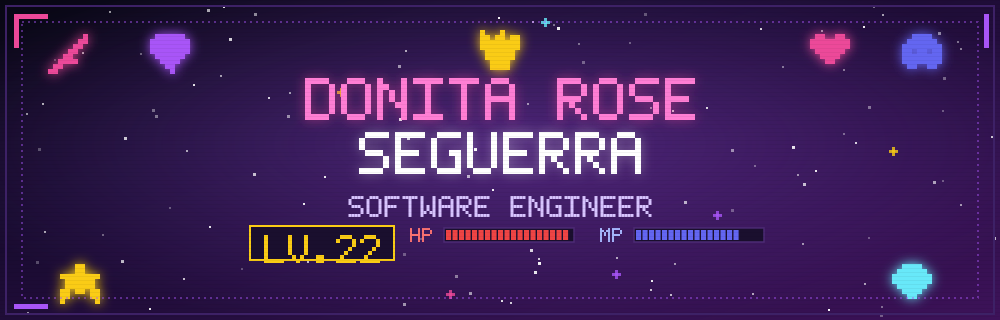
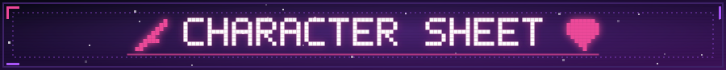
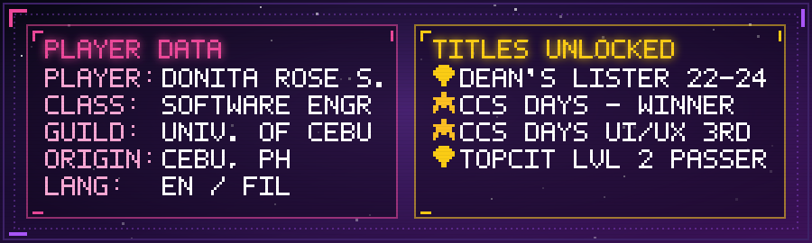
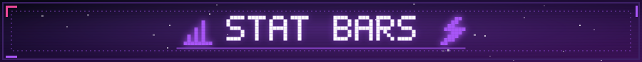
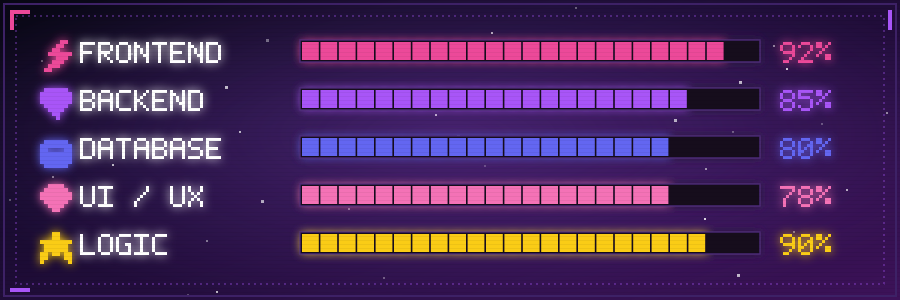
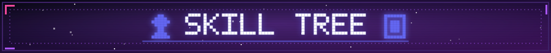
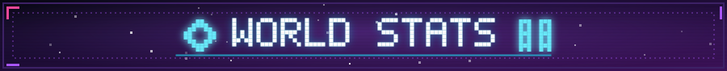
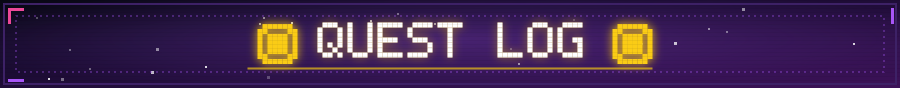
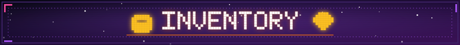
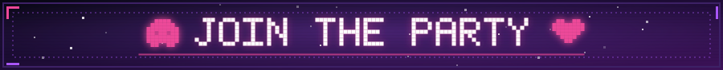

  

  

<!-- ============ CHARACTER SHEET ============ -->

  
  

<!-- ============ STAT BARS ============ -->

<!-- ============ SKILL TREE ============ -->

**🗡️ Languages**

  
  
  
  
  
  

**🛡️ Frameworks & Libraries**

  
  
  
  
  

**🔮 Databases**

  
  
  
  

**🧰 Tools & Practices**

  
  
  
  

<!-- ============ WORLD MAP / STATS ============ -->

> 📌 *Note: these stats reflect **public repositories only**. Hidden side-quests (private repos) aren't shown on this map.*

  
  

  

<!-- ============ QUEST LOG ============ -->

<table align="center">
<tr>
<td width="100%">

**🛡️ SIDE QUEST: Software Design & Development Intern**
*Leuterio Realty & Brokerage (Filipino Homes)* · `Aug 2025 – Oct 2025` · Cebu, Philippines
`REWARD: +500 XP Full-Stack Design`

- 🎯 UI/UX designer and system architect for **Rentsouq.ae**, a full-scale JavaScript real estate platform (React.js, MongoDB, RESTful APIs) built for the Dubai market
- 🗺️ Drafted wireframes and interactive prototypes in Figma, mapping the information architecture that guided the dev party's build
- ⚔️ Fought on the frontline of frontend development — building UI components and wiring up RESTful APIs
- 🧪 Ran structured usability-testing raids that boosted navigation clarity and task completion

</td>
</tr>
</table>

<!-- ============ INVENTORY ============ -->

<table align="center" width="100%">
<tr>
<td width="18%" align="center"></td>
<td width="82%">

**🌪️ Smartbash**
Multilingual (EN / Bisaya / Tagalog) disaster-reporting system — fine-tuned XLM-RoBERTa classifier (98.32% F1), CLIP photo validation, DBSCAN clustering, A* routing
`Next.js/React · Django · PostgreSQL/PostGIS`

</td>
</tr>
<tr>
<td align="center"></td>
<td>

**🧠 EchoMind**
AI-powered mental health journaling companion with NLP-based sentiment & emotion analysis
`React.js · CSS · Python · MySQL`

</td>
</tr>
<tr>
<td align="center"></td>
<td>

**🎓 UniJam**
Full-stack SaaS for event registration, attendance, feedback & analytics — soloed end-to-end
`React.js · REST · MySQL`

</td>
</tr>
<tr>
<td align="center"></td>
<td>

**🗳️ Election Voting System**
Secure voting platform with auth, ballot submission, validation, automated tabulation, and admin dashboards
`ASP.NET Core · C# · MS SQL Server`

</td>
</tr>
<tr>
<td align="center"></td>
<td>

**🕒 Employee Attendance Monitoring**
Time-in/out tracking, CRUD ops, and automated reporting dashboards
`ASP.NET Core · C# · MS SQL Server`

</td>
</tr>
</table>

<i>🎁 Bonus drops: Clinic & Veterinary Clinic Management, Registration/Rental/Intramurals Management systems + manual QA across 3 platforms, catching 50+ bugs before launch 🐛</i>

<!-- ============ MULTIPLAYER / CONNECT ============ -->

  
  

  

